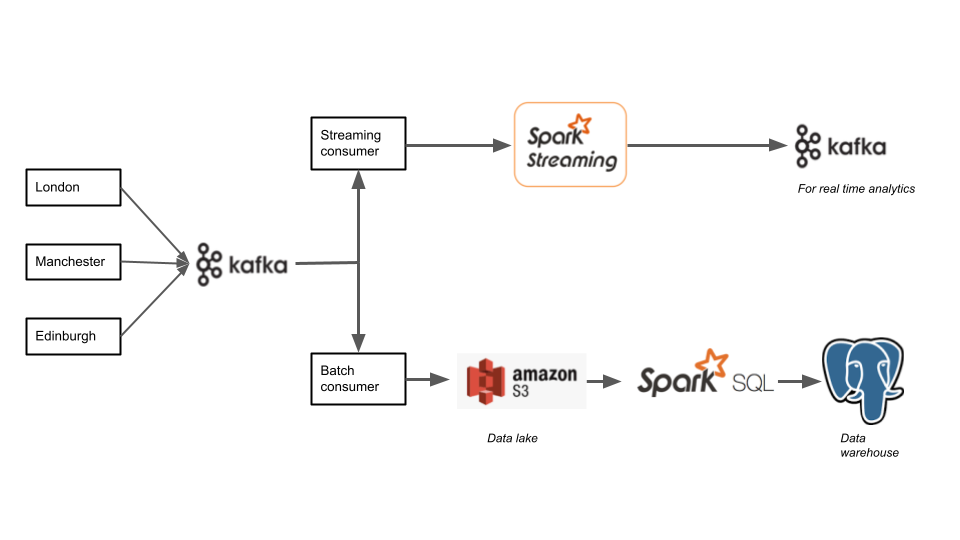

# Retail transaction processing pipeline.

An ETL and ELT pipeline that receives emulated transaction data from a chain of retail stores and applies batch and stream processessing in order to populate a data warehouse and provide quick metrics for real-time monitoring respectively.




_Key Scripts_ 

```store_emulator.py``` creates fictional transactions from three stores. The script also contains a kafka producer which sends the transactions as messages into the kafka topic ```SalesTransactions```.  

```batch_consumer.py``` reads these messages, extracts the transaction json data from the message, and uploads it to an S3 data lake.

```batch_processor.py``` is meant to run at regular itervals. It ingests the unprocessed data from the S3 data lake and processes it in order to create a data frame that can be inserted into the fact table in the PostgreSQL data warehouse.

```streaming_consumer.py``` also reads the messages from the ```SalesTransactions``` topic and extracts information into a form that is fed into the ```ProcessedTransactions``` kafka topic, where it can be used for real-time analytics. 

_Entity relationship diagram for data warehouse_ 
